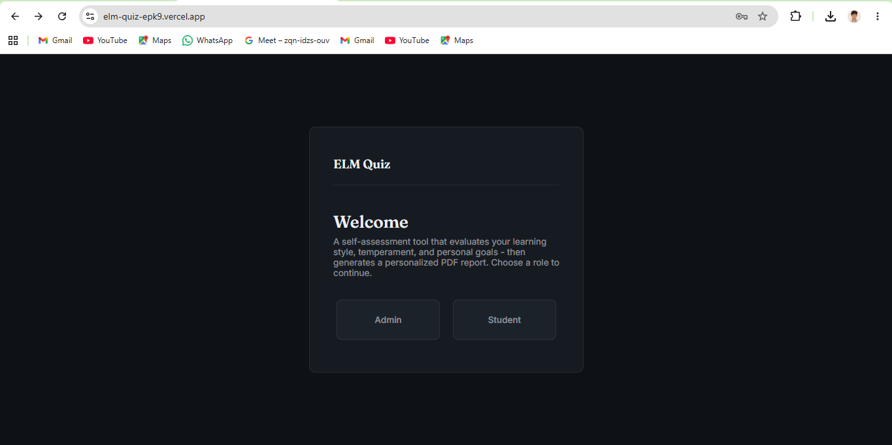
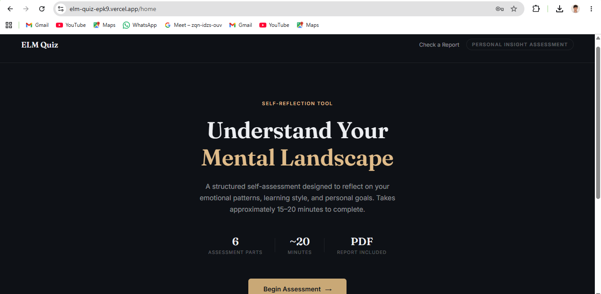
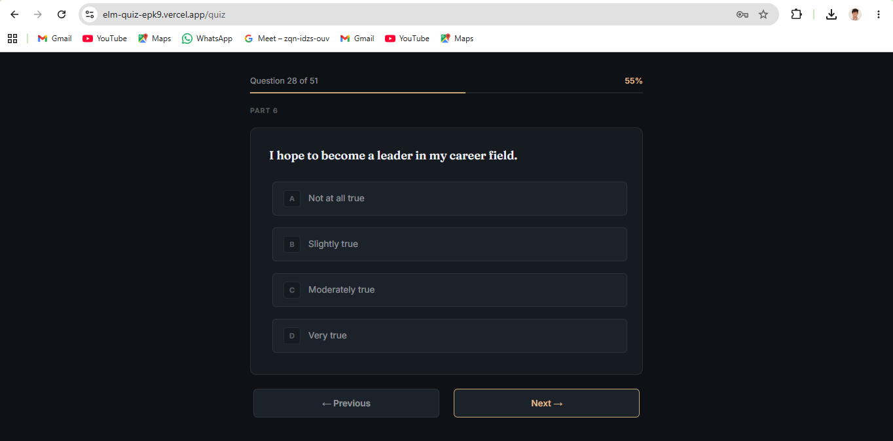
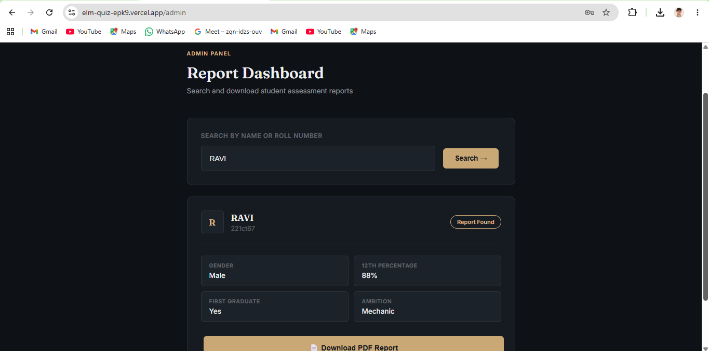
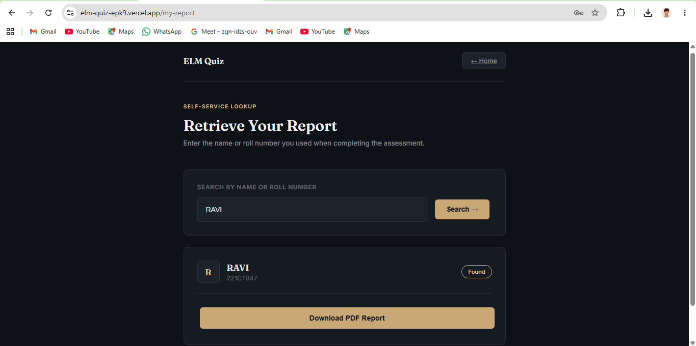

# ELM Quiz

*A self-assessment platform that digitizes a psychological evaluation instrument — from paper forms to automated scoring and personalized PDF reports.*

[](https://elm-quiz-epk9.vercel.app)


---

## Live Demo

🔗 **[elm-quiz-epk9.vercel.app](https://elm-quiz-epk9.vercel.app)**

**Demo Admin access** — User ID: `demo` · Password: `Demo@2025`
*(Anyone can also self-serve their own report after completing the assessment — no login required, via "Check a Report.")*

> ⏳ First request may take 30–50 seconds. The backend runs on a free hosting tier that sleeps after inactivity — subsequent requests are instant.

---

## Screenshots

| | |
|---|---|
|  |  |
| **Login** | **Home** |
|  |  |
| **Assessment** | **Admin Dashboard** |
|  | |
| **Self-Service Report Lookup** | |

📄 [View a sample generated PDF report](./docs/sample-report.pdf)

---

## About

ELM Quiz began as a task assigned by the Head of the Department of Psychology at **Kongunadu Arts and Science College (Autonomous)**, Coimbatore. The department's self-assessment instrument — spanning six psychological domains — was administered entirely on paper, with scoring and interpretation done manually. This was slow, inconsistent, and left no easy way to retrieve past results.

ELM Quiz automates the full pipeline: response collection → scoring → interpretation → personalized PDF report generation, while preserving the original instrument's scoring methodology.

## Features

- **Six-domain psychological assessment** — Self-Efficacy, Learning Style, College Readiness, Temperament, Social Support, and Aspiration
- **Automated scoring and interpretation**, faithful to the original paper instrument's scoring key
- **Personalized PDF report generation** with gender-aware language and structured, professional layout
- **Role-based access** — an Admin dashboard for lookup/download, and a public self-service lookup for demo visitors
- **Full MERN stack**, deployed and publicly accessible

## Tech Stack

**Frontend:** React · Vite · React Router
**Backend:** Node.js · Express · MongoDB · Mongoose
**PDF Generation:** PDFKit
**Hosting:** Vercel (frontend) · Render (backend) · MongoDB Atlas (database)

## Methodology

Scoring thresholds, question groupings, and reverse-scored items follow the original paper-based instrument's scoring key, adapted for digital delivery. See `/backend/utils/scoringHelper.js` and `determineScoreRange.js` for the full scoring logic.

## Known Limitations

This is a portfolio/demonstration deployment — a few deliberate tradeoffs worth being upfront about:

- **Roll number uniqueness isn't enforced at submission.** Report lookup returns the most recently submitted matching record if duplicates exist.
- **Self-service report lookup requires no authentication** beyond a name or roll number — intentional for a low-friction public demo, not suitable for production use with sensitive data.
- **No rate limiting** on report generation or lookup endpoints.
- **Free-tier hosting**: the backend (Render) sleeps after 15 minutes of inactivity, causing a one-time delay on the first request.

## Project Structure

```
ELMQuiz/
├── backend/
│   ├── models/         # Mongoose schemas
│   ├── routes/          # API routes (report generation, auth, lookup)
│   ├── utils/            # Scoring logic and PDF generation helpers
│   └── app.js
├── frontend/
│   └── src/
│       ├── components/  # Reusable UI components
│       ├── contexts/     # Auth and Quiz state management
│       ├── pages/         # Route-level pages
│       ├── data/          # Question bank (questions.json)
│       └── styles/        # CSS, design tokens
└── docs/                  # README assets — screenshots, sample PDF
```

## Running Locally

```bash
git clone https://github.com/DharanidharanRavikumar/ELMQuiz.git
cd ELMQuiz
npm install
npm run dev
```

This starts both the backend (port 3000) and frontend (Vite dev server) concurrently.

You'll need to create two `.env` files:

**`backend/.env`**
```
MONGO_URI=your_mongodb_connection_string
ADMIN_PASSWORD=your_chosen_admin_password
```

**`frontend/.env`**
```
VITE_API_URL=http://localhost:3000
```

## Author

**Dharanidharan Ravikumar**
[GitHub](https://github.com/DharanidharanRavikumar) · [LinkedIn](https://www.linkedin.com/in/dharani-dharan-r-)

Currently pursuing a Master's in Smart Convergence System Engineering at Dong-A University, Busan, with a focus on embedded systems and RISC-V architecture.
